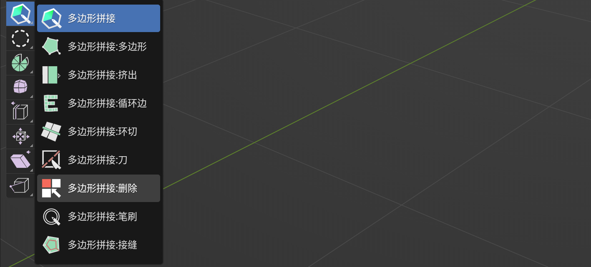
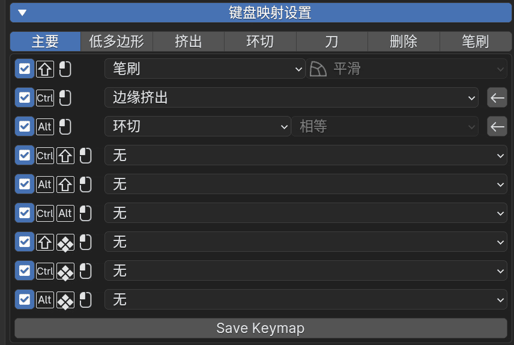

# 概述

> PolyQuilt是由多个交互式工具构成的插件，用于物体网格的编辑模式

以下分别是主工具（多边形拼接）和多个单一功能工具（多边形拼接：xxxx）

+ 多边形拼接：预设的多合一主工具（多边形/挤出/笔刷）

  

+ 多边形：制作点线面的工具

  

+ 挤出：单一点/边的挤出工具

  

+ 循环边：循环边移动与挤出工具

  

+ 环切：环切工具

  

+ *刀：切刀工具*

  

+ *删除：删除面的类笔刷工具*

  

+ 笔刷：三模式笔刷工具（平滑，移动，删除）

  

+ 接缝：绘制uv接缝的类笔刷工具

  

+ *四边形补丁：绘制两条线然后在中间补充四边面的填充工具*

  

## 工具和临时切换模式

在使用主工具或者任意单一工具时，可以**修饰键**（ctrl/shift/alt）等方式来调用其他工具的功能

其原理类似于雕刻模式使用普通笔刷时，**按住shift**可以临时切换到平滑笔刷进行平滑。

你可以通过这种方式来把单一工具充实为多功能工具

## 基本操作

> 以下是鼠标操作

| 快捷键  |                描述                 |
|:----:|:---------------------------------:|
|  单击  |           短时间内按下并松开鼠标左键           |
|  拖拽  |             按下并移动鼠标左键             |
|  保持  |     长时间按住鼠标左键。当标记变成圆圈时，保持完成。      |
| 按住拖动 | 将鼠标从保持状态移出（默认值为 0.4 秒, 可在偏好设置中修改） |

# 主要功能

> 也可通过侧边栏进行导航

+ [移动](./funcMove.md "移动")
+ [创建/删除](./funcCreate.md "创建/删除")
+ [环切](./funcLoopCut.md "环切")
+ [挤出](./funcExtrude.md "挤出")
+ [笔刷](./funcBrush.md "笔刷")

